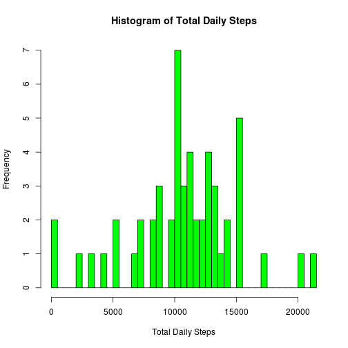
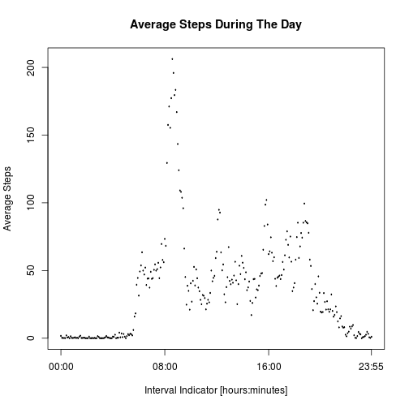
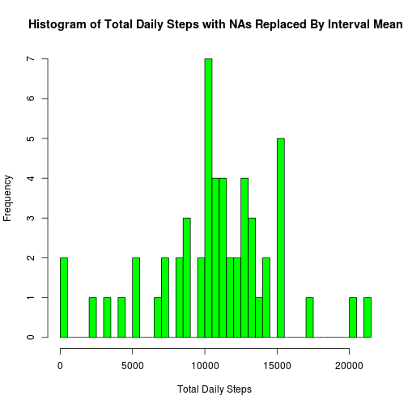
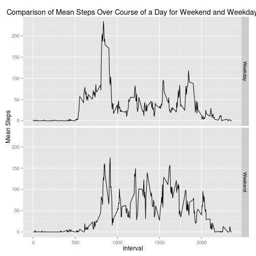

## Loading and preprocessing the data


```r
# The 3 column names are: steps, data & interval
# interval has the format hhmm; for example 35 minutes after midnight is "35" and 12:30 pm is "1230"
# Make sure the working directory is properly
# setwd("/home/brian/Documents/Coursera/Reproducible Research/RepData_PeerAssessment1")

dataFile = "activity.csv";
data <- read.csv(dataFile);
```

## What is mean total number of steps taken per day?


```r
# Histogram of Total Daily Steps
dailyTotal = aggregate(steps ~ date, data = data, FUN=sum);
hist(dailyTotal$steps, breaks = 50, col="green", xlab = "Total Daily Steps",
     main = "Histogram of Total Daily Steps");
```

 

```r
# Calculation of mean and median of total steps per day
meanTotalDailySteps = mean(dailyTotal$steps);
medianTotalDailySteps = median(dailyTotal$steps);
```

### The mean of total daily steps is: 10766.2.
### The median of total daily steps is: 10765.

## What is the average daily activity pattern?

```r
intervalAve = aggregate(steps ~ interval, data = data, FUN=mean);
intervalAve$intervalStr = (sprintf("%02i:%02i", floor(intervalAve$interval/100), intervalAve$interval %% 100))
plot(as.factor(intervalAve$intervalStr),  intervalAve$steps, type="l", xlab="Interval Indicator [hours:minutes]",
     ylab="Average Steps", main = "Average Steps During The Day", xaxt = "n");

tickIndex = c(1, 97, 193, 288);
axis(1, at = tickIndex, labels = c(intervalAve$intervalStr[tickIndex]));
```

 

```r
intervalOfMax = intervalAve$interval[which.max(intervalAve$steps)];
```

## Inputing missing values

```r
data$naRemovedSteps = data$steps;
naIndexes = is.na(data$steps);
data$naRemovedSteps[naIndexes] <- intervalAve$steps[naIndexes];

numberMissingValues = sum(naIndexes);

# Histogram of Total Daily Steps with NAs replaced by interval mean
naRemovedDailyTotal = aggregate(naRemovedSteps ~ date, data = data, FUN=sum);
hist(naRemovedDailyTotal$naRemovedSteps, breaks = 50, col="green", xlab = "Total Daily Steps ", main = "Histogram of Total Daily Steps with NAs Replaced By Interval Mean");
```

 

```r
# Calculation of mean and median of total steps per day with NAs replaced by interval mean
naRemovedMeanTotalDailySteps = mean(naRemovedDailyTotal$naRemovedSteps);
naRemovedMedianTotalDailySteps = median(naRemovedDailyTotal$naRemovedSteps);
```

### The mean of total daily steps with NAs replaced by interval mean is: 10766.2.
### The median of total daily steps with NAs replaced by interval mean is: 10765.6.

## Are there differences in activity patterns between weekdays and weekends?


```r
data$dayOfWeek = weekdays(as.POSIXct(data$date, format= "%m/%d/%Y"));
data$weekendLogical = grepl("Saturday", data$dayOfWeek) | grepl("Sunday", data$dayOfWeek);
data$weekendFactor = "Weekday";
data$weekendFactor[data$weekendLogical] = "Weekend";

intervalAveByWeekdayType = aggregate(naRemovedSteps ~ interval + weekendFactor, data=data, FUN=mean);

library(ggplot2)
h = qplot(interval, naRemovedSteps, data = intervalAveByWeekdayType, facets = weekendFactor~., geom = "line", xlab = " Interval", ylab = "Mean Steps", main = "Comparison of Mean Steps Over Course of a Day for Weekend and Weekday")
print(h)
```

 
